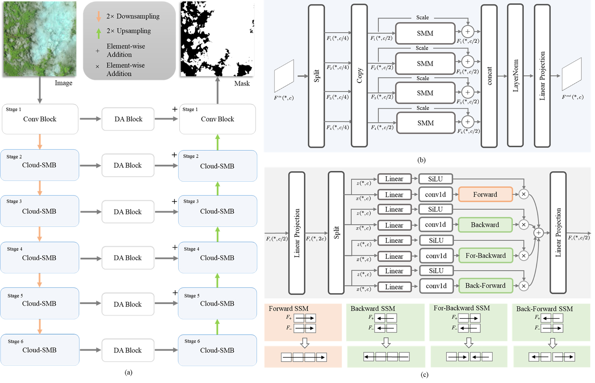

# CD-Mamba: Cloud Detection with Long-Range Spatial Dependency Modeling
<!-- - [arXiv](https://arxiv.org/abs/2509.xxxxx) -->
- The Biome dataset was [split using 4-fold cross-validation](./split), and only the Red, Green, Blue, and Near-Infrared bands were used.
	- [Mask Download link](https://drive.google.com/file/d/16hXumZitYItkqnNssattDAU37r812EcL/view?usp=sharing)
	- [Biome Dataset](https://landsat.usgs.gov/landsat-8-cloud-cover-assessment-validation-data)

Remote sensing images are frequently obscured by cloud cover, posing significant challenges to data integrity and reliability. Effective cloud detection requires addressing both short-range spatial redundancies and long-range atmospheric similarities among cloud patches. Convolutional neural networks are effective at capturing local spatial dependencies, while Mamba has strong capabilities in modeling long-range dependencies. To fully leverage both local spatial relations and long-range dependencies, we propose CD-Mamba, a hybrid model that integrates convolution and Mamba’s state-space modeling into a unified cloud detection network. CD-Mamba is designed to comprehensively capture pixel-wise textural details and long-term patch-wise dependencies for cloud detection. This design enables CD-Mamba to manage both pixel-wise interactions and extensive patch-wise dependencies simultaneously, improving detection accuracy across diverse spatial scales. Extensive experiments validate the effectiveness of CD-Mamba and demonstrate its superior performance over existing methods.



# Experiment
## Train
```sh
# Replace the package in your Mamba env lib/python3.10/site-packages/ 
# with the one from folder mamba_ssm.
cd f01
python traincloudmamba.py
```

# Citation
We appreciate it if you cite the following paper:
```sh
@Article{xueJARS2025,
  author  = {Tianxiang Xue and Jiayi Zhao and Jingsheng Li and Changlu Chen and Kun Zhan},
  journal = {Journal of Applied Remote Sensing},
  title   = {{CD-Mamba}: Cloud detection with long-range spatial dependency modeling},
  year    = {2025},
  volume  = {19},
}

```

# Contact
https://kunzhan.github.io/

If you have any questions, feel free to contact me. (Email: `ice.echo#gmail.com`)